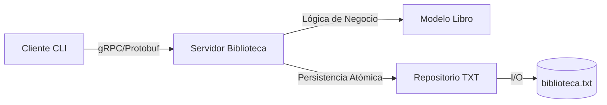

# Reporte de Entrega: Taller de Sistemas Distribuidos (gRPC)

**Proyecto:** Sistema Remoto de Gestión de Biblioteca  
**Fecha:** 26 de Febrero de 2026  
**Tecnologías:** Python 3, gRPC, Protocol Buffers
**Integrantes:** Juan Sebastian Urbano, Juan Diego Pardo


---

## 1. Introducción
Este proyecto implementa un servicio remoto para la gestión de una biblioteca, permitiendo realizar consultas, préstamos y devoluciones de libros de manera concurrente. El sistema utiliza **gRPC** como framework de comunicación, lo que permite una definición estricta de la interfaz de servicios y una serialización eficiente mediante **Protobuf**.

## 2. Arquitectura del Sistema
El sistema se ha diseñado siguiendo principios de modularidad y separación de responsabilidades:

- **Capa de Aplicación (`server.py` / `client.py`)**: Maneja la comunicación gRPC y la interacción con el usuario.
- **Capa de Dominio (`models.py`)**: Define la entidad `Libro` y las reglas de validación del sistema.
- **Capa de Persistencia (`repo_txt.py`)**: Implementa el patrón Repository para gestionar la base de datos en archivo plano (`biblioteca.txt`).

### Diagrama de Flujo Lógico


## 3. Características Implementadas

### 3.1. Concurrencia y Seguridad
- **Thread-Safety**: El servidor utiliza un `ThreadPoolExecutor` para manejar múltiples clientes simultáneos.
- **Manejo de Locks**: Se implementó `threading.Lock` en el repositorio para garantizar que las operaciones de lectura/escritura en el archivo plano sean atómicas y no produzcan corrupción de datos.

### 3.2. Robustez y Validación
- **Validación de Datos**: Los ISBN se validan bajo el estándar de 13 dígitos numéricos.
- **Códigos de Estado gRPC**: Se utilizan códigos estándar (`NOT_FOUND`, `INVALID_ARGUMENT`, `FAILED_PRECONDITION`) para una gestión de errores profesional.
- **Escritura Atómica**: Los cambios en el archivo `.txt` se realizan mediante un archivo temporal y reemplazo atómico, evitando estados parciales en caso de fallo crítico.

## 4. Manual de Ejecución

### Instalación de Dependencias
```bash
pip install grpcio grpcio-tools pytest
```

### Compilación del Contrato (Proto)
```bash
python -m grpc_tools.protoc -I. --python_out=. --grpc_python_out=. biblioteca.proto
```

### Ejecución de Pruebas
Se incluyen dos niveles de testing:
- **Unitarios (`test_repo.py`)**: Validan la lógica interna y persistencia.
- **Integración (`test_server.py`)**: Validan el ciclo completo de vida de las peticiones gRPC.

```bash
python -m pytest -v
```

## 5. Resultados de Pruebas
Todas las pruebas unitarias y de integración han sido ejecutadas exitosamente. El sistema maneja correctamente:
- [x] Préstamos con stock disponible.
- [x] Bloqueo de préstamos para libros agotados.
- [x] Consultas de libros inexistentes.
- [x] Devoluciones que incrementan el stock disponible.

---

